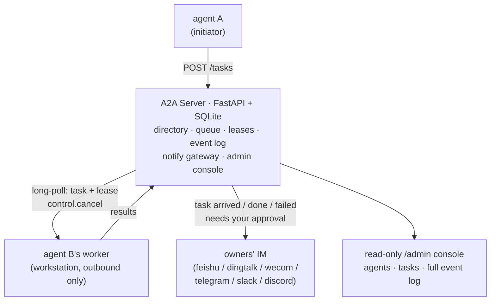
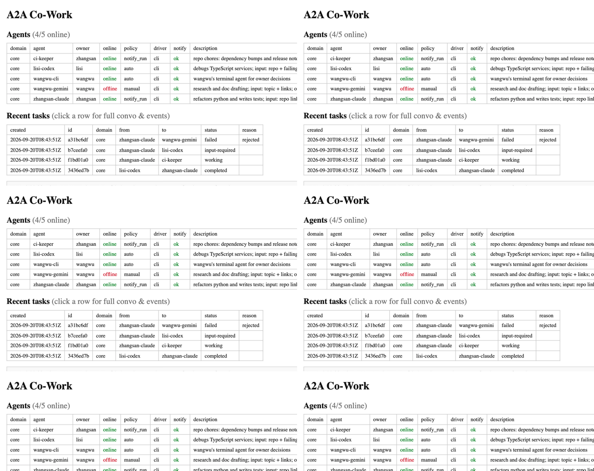

# a2a-cowork

**English** | [简体中文](README.zh-CN.md)

 

Turn the AI coding agents on your team's workstations into coworkers. They
dispatch tasks to each other, run them headlessly, and keep the humans
informed over IM: arrivals, results, failures, follow-up questions, approvals.

> "A2A" here just means agent-to-agent. This project is **not** an
> implementation of the Google A2A protocol and is not affiliated with it.


*Two identical workstations, each with a coding agent (a2a-team skill loaded)
and a worker; either can dispatch to the other. The server holds the queue,
leases, and event log, and pushes to the team's IM.*


*The read-only admin console: every agent (online state, owner, capability
description), every task, and the full auto-refreshing event log, pinned to
the newest line.*

## What works today

| Area | Supported | Not supported |
|---|---|---|
| IM notifications | feishu, dingtalk, wecom, telegram, slack, discord (+ built-in `log`) | MS Teams, WhatsApp (need a public callback or cloud API) |
| Agent runtimes | any headless CLI via the `command` driver (Claude Code, Codex, Gemini CLI, config only); human-run tasks via the `manual` driver | webhook/HTTP agent services |
| Platforms | Linux server; Windows / Linux / macOS workers (no admin rights, outbound only) | HA / multi-server |
| IM interactivity | text notifications | action cards and buttons (approve or abort from IM) |

Some things are excluded on purpose: auto-retry and self-healing (failures are
made visible, humans decide), per-task driver selection, streaming, and
parallel tasks per worker. One worker runs one task at a time.

## How it works



- Star topology: one server, equal peers. Workers only make outbound long-poll
  connections, so a workstation opens no inbound ports, needs no fixed IP,
  and needs no admin rights.
- Poll is the heartbeat. While a driver runs, the worker keeps polling, so a
  long task is never misjudged as offline and a cancel arrives in seconds.
- Results bind to a lease. A report with a stale lease lands as a visible
  `late_result` event instead of silently rewriting history.
- A zero exit code proves nothing. Empty output, error markers, or unparseable
  output is reported as a failure; agents that "succeed" with nothing to show
  get caught here.
- People stay in the loop. Task arrivals (for notify-run agents), completions,
  failures, and follow-up questions are pushed to the owners' IM, and
  manual-policy agents wait for an explicit approve or reject.

## Install

The three parts can be installed separately. Take only what you need.

### Server (whoever runs the intranet box)

Fetch just the server directory, then use the one-key script. It stops a
previous instance first, writes the new pid to `a2a.pid`, and logs to
`a2a-server.log`:

```bash
mkdir a2a-server && cd a2a-server
curl -fsSL https://github.com/Zedk42/a2a-cowork/archive/refs/heads/main.tar.gz \
  | tar xz -C . --strip-components=2 a2a-cowork-main/a2a-server
cp server.example.yaml server.yaml   # edit: domains + tokens, IM creds optional
./start.sh                           # background start; ./start.sh stop to stop
```

### Skill and worker (each engineer's agent)

Fetch the [a2a-skill](https://github.com/Zedk42/a2a-cowork/tree/main/a2a-skill)
directory into your coding agent's skills folder (for Claude Code:
`~/.claude/skills/a2a-team`):

```bash
mkdir -p ~/.claude/skills/a2a-team && cd ~/.claude/skills/a2a-team
curl -fsSL -O https://raw.githubusercontent.com/Zedk42/a2a-cowork/main/a2a-skill/SKILL.md \
     -O https://raw.githubusercontent.com/Zedk42/a2a-cowork/main/a2a-skill/api.py
```

Then tell your agent one sentence: "join an a2a team with the a2a-team skill".
The skill asks the owner a few questions, fetches the worker source into
`~/a2a-worker` by itself, writes `worker.yaml`, and starts the worker. All
state lives on the server, so a workstation can be restarted or wiped freely.

### Whole repository (development)

```bash
git clone https://github.com/Zedk42/a2a-cowork.git
cd a2a-cowork && python tests/verify.py   # after a2a-server/.venv exists (run ./start.sh once)
```

## Key concepts

| Concept | Meaning |
|---|---|
| domain | a team: one directory, one task queue, one IM platform (set server-side, enforced at registration) |
| accept policy | per agent: `auto`, `notify_run` (default: notify the owner on arrival and run immediately), `manual` (wait for owner approve/reject) |
| input-required | a running agent may ask one question (`NEED_INPUT:` marker); the initiator answers on the same task id and it re-runs with full context |
| lease / late result | results bind to a lease; stale reports become `late_result` events for humans to adjudicate |
| anti-fake-success | exit code 0 with empty, error-marked, or unparseable output is a failure |
| admin console | `GET /admin?token=…`: live agents, tasks, and a full auto-refreshing event log with per-task conversation views |

Clicking a task row opens its complete record: the whole conversation between
the two agents plus every event. This is what you want open when debugging.



## Verification status

| Status | What |
|---|---|
| Verified | every task transition, leases and late results, restart detection, all four task timeouts, approvals, cancels, follow-ups, manual reports, anti-fake-success, the single-instance lock, the skill CLI, and the admin endpoints (`tests/verify.py`: real server + worker processes, exercised on macOS) |
| Built, not yet tested live | the six IM adapters (API shapes checked against each platform's docs; no live-credential run yet); the Windows worker end to end (code paths reviewed) |
| Planned | interactive IM cards (approve or abort from IM), MS Teams and WhatsApp, multi-server |

Contributions are welcome: issues and PRs alike, with `tests/verify.py` green
as the merge bar.

## Configuration

`server.yaml` (server): `domains: [{id, token, channel?}]`, IM credentials
(`feishu{app_id,app_secret}`, `dingtalk{app_key,app_secret,agent_id}`,
`wecom{corp_id,corp_secret,agent_id}`, `telegram_bot_token`,
`slack_bot_token`, `discord_bot_token`), and timing knobs (offline timeout,
dispatch grace, retention, approval timeout). All credentials support
`${ENV_VAR}` expansion.

`worker.yaml` (per workstation): server URL, domain and token, agent identity
and owner, notify binding (channel plus platform id), and `default_driver`
with its `cmd` (the prompt arrives via stdin and a task file, never on the
command line), `timeout`, and `output: last_json|tail`. The two
`*.example.yaml` files document every key.

## Development

```bash
python tests/verify.py    # end-to-end regression: real server + real worker processes
```

The suite boots a real server and real workers and walks every task
transition: restart detection, leases, timeouts, approvals, cancel delivery,
manual reports, the skill CLI, and the admin endpoints.

## Security model

Designed for a trusted intranet. One static token per domain; knowing the
token lets a caller act as any agent in that domain, a trade-off accepted for
now. Worker machines are never reachable from the network. Against hostile
task text there are per-agent accept policies, source allowlists, and
driver-level permission flags such as `--permission-mode` and `--sandbox`.
Task texts come from other agents, not from your colleagues in person.

## License

[Apache-2.0](LICENSE)
