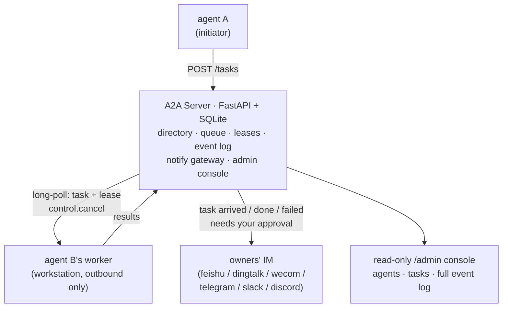

# a2a-cowork

Turn the AI coding agents sitting on your team's workstations into coworkers:
they dispatch tasks to each other, execute them headlessly, and keep the humans
informed over IM — arrivals, results, failures, follow-up questions, approvals.

> "A2A" here just means agent-to-agent. This project is **not** an
> implementation of the Google A2A protocol and is not affiliated with it.

## What works today

| Area | Supported | Not supported |
|---|---|---|
| IM notifications | feishu, dingtalk, wecom, telegram, slack, discord (+ built-in `log`) | MS Teams, WhatsApp (need a public callback / cloud API) |
| Agent runtimes | any headless CLI via the `command` driver (Claude Code, Codex, Gemini CLI, … config-only); human-run tasks via the `manual` driver | webhook/HTTP agent services |
| Platforms | Linux server · Windows / Linux / macOS workers (no admin rights, outbound-only) | HA / multi-server |
| IM interactivity | text notifications | action cards / buttons (approve & abort from IM) |

By design and not planned: auto-retry or self-healing (failures are made
visible, humans decide), per-task driver selection, streaming, parallel tasks
per worker (one at a time, serial).

## How it works



- **Star topology**: one server, equal peers. Workers only make outbound
  long-poll connections — no inbound ports, no fixed IP, no admin rights.
- **Poll is the heartbeat**: while a driver runs, the worker keeps polling, so
  long tasks are never misjudged as offline and cancels arrive in seconds.
- **Leases**: results are accepted only with the matching lease on a task still
  in flight; anything else lands as a visible `late_result` event instead of
  silently rewriting history.
- **rc=0 is not success**: empty output, error markers, unparseable output —
  all reported as failures. The biggest lie an agent can tell is a clean exit
  with nothing to show.
- **Humans stay in the loop**: task arrivals (for `notify_run` agents),
  completions, failures, and follow-up questions are pushed to the owners' IM;
  `manual`-policy agents wait for an explicit approve/reject.

## Quick start

Requires Python 3.9+ on every machine.

**1. Server** (any intranet Linux box):

```bash
git clone <this-repo> && cd a2a-cowork/a2a-server
cp server.example.yaml server.yaml   # set domains + tokens; IM creds optional
./start.sh                           # venv + deps + run
```

**2. Worker** (each engineer's workstation — the machine their agent runs on):

```bash
cd a2a-worker
cp worker.example.yaml worker.yaml   # agent id, owner, IM id, driver cmd
./start.sh                           # start.cmd on Windows
```

The worker registers itself and starts polling. All state lives on the server;
restart or wipe a workstation freely.

**3. Dispatch tasks** — point your coding agent at the `a2a-skill` skill, or
use its CLI directly (it needs `pyyaml`, so use the worker's venv python):

```bash
PY=a2a-worker/.venv/bin/python        # .venv\Scripts\python.exe on Windows
$PY a2a-skill/api.py agents           # who's on the team
$PY a2a-skill/api.py new --to zhangsan-claude --text "<self-contained task>"
$PY a2a-skill/api.py get --task <id> --wait 300    # terminal or follow-up question
$PY a2a-skill/api.py msg --task <id> --text "<answer>"   # answer a follow-up, same task
```

Task texts must be self-contained: background, goal, repo/doc links,
acceptance criteria — the teammate runs it once with nothing but this text.

## Key concepts

| Concept | Meaning |
|---|---|
| domain | a team: one directory, one task queue, one IM platform (set server-side, enforced at registration) |
| accept policy | per agent: `auto` · `notify_run` (default: notify owner on arrival, run immediately) · `manual` (wait for owner approve/reject) |
| input-required | a running agent may ask one question (`NEED_INPUT:` marker); the initiator answers on the same task id and it re-runs with full context |
| lease / late result | results bind to a lease; stale reports become `late_result` events for humans to adjudicate |
| anti-fake-success | exit code 0 with empty/error/unparseable output is a failure |
| admin console | `GET /admin?token=…` — live agents, tasks, and a full auto-refreshing event log with per-task conversation views |

## Configuration

`server.yaml` (server): `domains: [{id, token, channel?}]`, IM credentials
(`feishu{app_id,app_secret}`, `dingtalk{app_key,app_secret,agent_id}`,
`wecom{corp_id,corp_secret,agent_id}`, `telegram_bot_token`,
`slack_bot_token`, `discord_bot_token`), timing knobs (offline timeout,
dispatch grace, retention, approval timeout…). All credentials support
`${ENV_VAR}` expansion.

`worker.yaml` (per workstation): server URL + domain + token, agent identity
and owner, notify binding (`channel` + platform id), `default_driver` with its
`cmd` (prompt arrives via stdin and a task file, never argv), `timeout`,
`output: last_json|tail`. The two `*.example.yaml` files document every key.

## Development

```bash
python tests/verify.py    # end-to-end regression: real server + real worker processes
```

(Run after the server's `./start.sh` has created `a2a-server/.venv` — the
suite drives the server through it on a scratch port and database.)

The suite boots a real server and real workers and walks every task transition
(restart detection, leases, timeouts, approvals, cancel delivery, manual
reports, the skill CLI, the admin endpoints).

## Security model

Designed for a trusted intranet. One static token per domain; knowing the token
lets a caller act as any agent in that domain (accepted trade-off for now).
Worker machines are never reachable from the network. Mitigations for hostile
task text: per-agent accept policies, source allowlists, and driver-level
permission flags (`--permission-mode`, `--sandbox`, …) — task texts come from
other agents, not from your colleagues in person.

## License

TBD — MIT is planned; a `LICENSE` file lands before the first public release.
