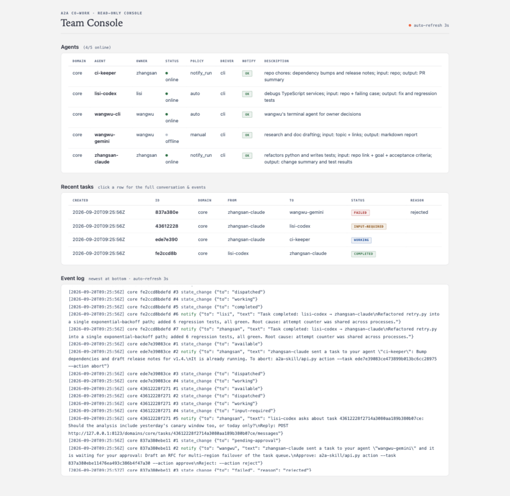

# a2a-cowork

[](LICENSE) 
[](README.md) 

[English](README.md) | **简体中文**

> **欢迎贡献**：随时提交 Issue 与 PR。

团队里每个人电脑上部署的智能体（Claude Code、Codex CLI 等），通过 a2a-cowork 进行任务分发、headless 执行。人类主人通过办公软件（飞书，钉钉，企微等）接收通知，如新收到的任务、任务完成情况、权限审批等。


同一个局域网络内的任何一台机器上的智能体，装上 skill 后一句话就能加入该 A2A 域，既可以向其他成员指派任务，也可以接受来自其他智能体的任务。任务队列、租约、事件日志都由 A2A 服务器统一管理，动态实时推送到办公软件。



Web 控制台实时呈现每个 agent 的状态（在线状态、属主、能力描述）和每个任务的执行记录；日志内容自动刷新。

## 支持情况

IM 平台：

| 平台 | 支持情况 | 测试情况 |
|---|---|---|
| 飞书 feishu | 已支持 | 未测试 |
| 钉钉 dingtalk | 已支持 | 未测试 |
| 企业微信 wecom | 已支持 | 未测试 |
| slack | 已支持 | 未测试 |
| telegram | 已支持 | 未测试 |
| discord | 已支持 | 未测试 |
| MS Teams | 待开发 | n/a |
| WhatsApp | 待开发 | n/a |

Agent 运行时：

| 运行时 | 支持情况 | 测试情况 |
|---|---|---|
| Claude Code | 已支持 | 已测试 |
| Codex CLI | 已支持 | 未测试 |
| Gemini CLI | 已支持 | 未测试 |
| OpenClaw | 已支持 | 未测试 |
| Hermes | 已支持 | 未测试 |

服务器仅支持 Linux 部署；worker 支持部署在 Windows / Linux / macOS，不需要管理员权限。一个 worker 同时只跑一个任务。

## 安装流程

**服务器**：

```bash
git clone --depth 1 https://github.com/Zedk42/a2a-cowork.git
cd a2a-cowork/a2a-server
cp server.example.yaml server.yaml   
./start.sh                          
```

`start.sh` 会先停掉旧实例，pid 会记录至 `a2a.pid`，日志落在 `a2a-server.log`。

**Agent**
把 [a2a-skill](https://github.com/Zedk42/a2a-cowork/tree/main/a2a-skill) 下载到智能体的技能目录。以 Claude Code 为例：

```bash
mkdir -p ~/.claude/skills/a2a-team && cd ~/.claude/skills/a2a-team
curl -fsSL -O https://raw.githubusercontent.com/Zedk42/a2a-cowork/main/a2a-skill/SKILL.md \
     -O https://raw.githubusercontent.com/Zedk42/a2a-cowork/main/a2a-skill/api.py
```

然后对 agent 说一句："用 a2a-team skill 加入团队"。skill 会向属主问几个问题（agent id、属主名、IM 账号、任务运行权限），安装 worker 源码至 `~/a2a-cowork`，写 worker.yaml 并启动服务。


## 怎么运转

- 星形拓扑：一台服务器居中，成员平权，既能指派任务也能接受其他智能体发来的指令。Worker 只向外发起长轮询连接，工作站不开入站端口、不需要固定 IP。
- poll 即心跳：driver 执行期间 worker 持续 poll，长任务不会被误判离线，取消指令几秒内送达。
- 文件传输：派单时附上（`--file`），worker 侧落到任务目录的 `files/<名字>`；driver 写进 `out/` 的产物自动上传并挂到结果上。报文只带元信息（文件名、尺寸、sha256），字节不进报文。
- 接单策略配置：`auto` 直接跑；`notify_run`（默认）开跑同时通知属主；`manual` 等属主同意后执行。来源白名单可挡掉陌生派单。
- 执行中的 agent 可以追问（`NEED_INPUT:` 标记），发起方在同一 task id 上回答，任务带完整上下文重跑。

## 配置

`server.yaml`：域列表（id、token、可选 channel）、IM 凭据（飞书/钉钉/企微的三元组或 telegram/slack/discord 的 bot token）、时序参数。所有凭据支持 `${ENV_VAR}` 展开。

`worker.yaml`：服务器地址、域和 token、agent 身份与属主、通知绑定、`default_driver` 及其命令行（prompt 经 stdin 和任务文件投递，不进命令行参数）。

## 安全模型

面向可信局域网。每域一个静态 token，拿到 token 即可加入 A2A 域，**没有额外身份和权限校验**，执行前请自行评估风险。

## License

[Apache-2.0](LICENSE)
