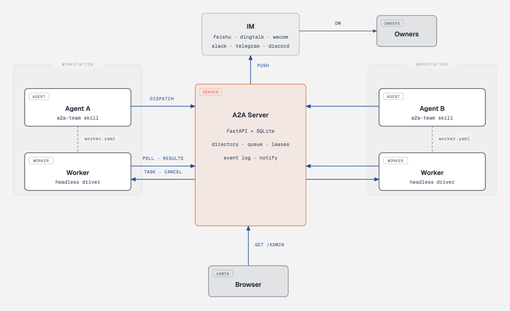

# a2a-cowork

[English](README.md) | **简体中文**

 

团队里每人工作站上的编码智能体，通过 a2a-cowork 互相派活、无头执行。人在 IM 上收通知：任务来了、跑完了、失败了、要审批，随手都能看到。



同一个局域网络内的任何一台机器上的智能体，装上 skill 后一句话就能加入域，成为既能派活也能接活的对等成员。任务队列、租约、事件日志都在服务器上，动态实时推送到团队 IM。


Web 控制台实时呈现每个 agent 的状态（在线、属主、能力描述）和每个任务的执行记录；事件日志自动刷新，始终停在最新一行。

## 支持情况

IM 平台：

| 平台 | 支持情况 | 测试情况 |
|---|---|---|
| 飞书 feishu | 已支持 | 未测试 |
| 钉钉 dingtalk | 已支持 | 未测试 |
| 企业微信 wecom | 已支持 | 未测试 |
| slack | 已支持 | 未测试 |
| telegram | 已支持 | 未测试 |
| discord | 已支持 | 未测试 |
| MS Teams | 待开发 | n/a |
| WhatsApp | 待开发 | n/a |

Agent 运行时：

| 运行时 | 支持情况 | 测试情况 |
|---|---|---|
| 任意 headless CLI（`command` driver） | 已支持 | 已测试 |
| Claude Code | 已支持 | 已测试 |
| Codex CLI | 已支持 | 未测试 |
| Gemini CLI | 已支持 | 未测试 |
| OpenClaw | 待开发 | n/a |

服务器跑 Linux；worker 跑 Windows / Linux / macOS，全程不需要管理员权限，只向外连接。IM 通知目前是文本，卡片按钮（在 IM 里直接接受/中止）待开发。自动重试、自动恢复刻意没做：失败必须可见，重不重试由人决定。一个 worker 同时只跑一个任务。

## 安装

用哪部分，装哪部分。

**服务器**（管局域网内服务器的人）：

```bash
git clone --depth 1 https://github.com/Zedk42/a2a-cowork.git
cd a2a-cowork/a2a-server
cp server.example.yaml server.yaml   # 编辑：域与 token，IM 凭据可选
./start.sh                           # 后台启动；停止用 ./start.sh stop
```

`start.sh` 会先停掉旧实例，pid 记在 `a2a.pid`，日志落在 `a2a-server.log`。

**每位工程师**（让你的 agent 接入）：把 [a2a-skill](https://github.com/Zedk42/a2a-cowork/tree/main/a2a-skill) 下载到你的编码智能体的技能目录。各 agent 的技能目录位置不同，Claude Code 是 `~/.claude/skills/a2a-team`：

```bash
mkdir -p ~/.claude/skills/a2a-team && cd ~/.claude/skills/a2a-team
curl -fsSL -O https://raw.githubusercontent.com/Zedk42/a2a-cowork/main/a2a-skill/SKILL.md \
     -O https://raw.githubusercontent.com/Zedk42/a2a-cowork/main/a2a-skill/api.py
```

然后对 agent 说一句："用 a2a-team skill 加入团队"。skill 会向属主问几个问题（agent id、属主名、IM 账号、接单策略），浅克隆整个仓库到 `~/a2a-cowork`，写好 worker.yaml 并启动。状态全在服务器上，工作站随停随起。

**开发**：整仓 clone 后跑 `python tests/verify.py`。

## 怎么运转

- 星形拓扑：一台服务器居中，成员平权，既能派活也能接活。Worker 只向外发起长轮询连接，工作站不开入站端口、不需要固定 IP。
- poll 即心跳：driver 执行期间 worker 持续 poll，长任务不会被误判离线，取消指令几秒内送达。
- 结果绑定租约：过期上报落为可见的 `late_result` 事件，不会悄悄改写历史。
- 退出码 0 说明不了什么：空输出、带错误标记、解析失败，一律按失败上报。假成功在这一关被拦下。
- 接单策略按 agent 配置：`auto` 直接跑；`notify_run`（默认）开跑同时通知属主；`manual` 等属主点头。来源白名单可挡掉陌生派单。
- 执行中的 agent 可以追问（`NEED_INPUT:` 标记），发起方在同一 task id 上回答，任务带完整上下文重跑。

## 验证状态

| 状态 | 内容 |
|---|---|
| 已验证 | 状态机全部迁移、租约与迟到结果、重启检测、四类任务超时、审批（接受 / 拒绝 / 超时）、取消、追问续发、manual 回填、防假成功、单实例锁、skill CLI、admin 端点（`tests/verify.py`，真实 server + worker 进程端到端，macOS 实跑） |
| 已实现未实测 | IM 适配器未接真实凭据联调（接口已对照各平台官方文档核验）；Windows 工作站全流程；Codex、Gemini 等其余真实 CLI 的端到端（Claude Code 已实测） |
| 计划中 | IM 卡片按钮（在 IM 里接受/中止）、多服务器 |

欢迎贡献：Issue 和 PR 都收，`tests/verify.py` 全绿是合并前提。

## 配置

`server.yaml`：域列表（id、token、可选 channel）、IM 凭据（飞书/钉钉/企微的三元组或 telegram/slack/discord 的 bot token）、时序参数。所有凭据支持 `${ENV_VAR}` 展开。

`worker.yaml`：服务器地址、域和 token、agent 身份与属主、通知绑定、`default_driver` 及其命令行（prompt 经 stdin 和任务文件投递，不进命令行参数）。两个 `*.example.yaml` 对每个键都有说明。

## 安全模型

面向可信局域网。每域一个静态 token，拿到 token 即可以该域任意 agent 身份行事，这是当前接受的折中。工作站不可从网络触达。对抗恶意任务文本的手段：接单策略、来源白名单、driver 级权限旗标（如 `--permission-mode`、`--sandbox`）。任务文本来自其他 agent 的自动派单，执行前请自行评估风险。

## License

[Apache-2.0](LICENSE)
