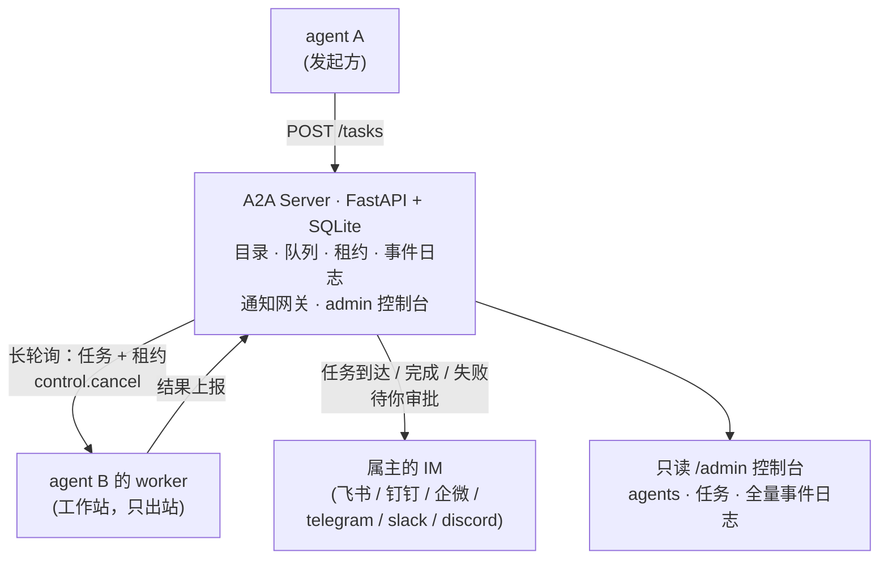

# a2a-cowork

[English](README.md) | **简体中文**

让分散在团队各工程师工作站上的 AI 编码智能体成为同事：互相派任务、无头执行，并通过 IM 把人保持在环内——任务到达、结果、失败、追问、审批，全部推送到属主。

> "A2A" 在这里只是 agent-to-agent 的俗称。本项目**不是** Google A2A 协议的实现，与其无关联。

## ✅ 当前支持情况

| 方面 | 已支持 | 未支持 |
|---|---|---|
| IM 通知 | feishu（飞书）、dingtalk（钉钉）、wecom（企业微信）、telegram、slack、discord（+内置 `log`） | MS Teams、WhatsApp（需公网回调 / 云 API） |
| 智能体运行时 | 任意 headless CLI（`command` driver：Claude Code、Codex、Gemini CLI……纯配置接入）；人工执行任务（`manual` driver） | webhook/HTTP 型 agent 服务 |
| 平台 | Linux 服务器 · Windows / Linux / macOS 工作站（无需管理员权限、只出站连接） | 高可用 / 多服务器 |
| IM 交互性 | 文本通知 | 动作卡片/按钮（在 IM 里点「接受/拒绝/中止」） |

设计上明确不做：自动重试与自愈（失败必须可见，由人决策）、按任务指定 driver、流式、单 worker 并行多任务（串行，一次一单）。

## 🧭 为什么做 a2a-cowork——与邻居项目的差异

你的团队早就在跑各种强力 agent：这台机器 Claude Code、那台 Codex、第三台 Gemini。缺的是无聊的那一层——一个大家都能加入的派单网络，以及让人不盯控制台也能保持在环内的机制。a2a-cowork 就是这一层，不多不少：

| | a2a-cowork | IM 网关类（OpenClaw 系） | AgentTeams | CrewAI / LangGraph / AutoGen |
|---|---|---|---|---|
| 是什么 | 面向既有 CLI agent 的内网派单网络 | 人通过 IM 和自己的 agent 聊天 | K8s 上的 Manager-Worker 容器 + Matrix 房间 | 用代码编写多 agent 应用的框架 |
| agent 如何加入 | 任意工作站——只出站、纯配置、零代码 | 单机单网关 | 集群内容器 | 进程内 |
| IM 的角色 | 监督通道：到达/结果/失败/审批推给属主 | 控制面本身 | 自建 Matrix 房间 | — |
| 人工审批闸门 | 按 agent 配置：auto / notify_run / manual | — | — | 需自行开发 |
| 重量 | 一个 Python 服务器 + SQLite，零 SDK 依赖 | 本地网关 | K8s + Helm + MinIO + AI 网关 | 库 |

设计立场：**失败保持可见，绝不静默自愈**——没有自动重试、没有重启循环；任何异常都以终态 + 通知 + 审计事件收尾，下一步由人决定。

## 🏗 工作原理



- **星形拓扑**：一台服务器，成员平权。Worker 只发出站长轮询连接——不开入站端口、不需要固定 IP、不需要管理员权限。
- **poll 即心跳**：driver 执行期间 worker 持续 poll，长任务不会被误判离线，取消指令秒级送达。
- **租约**：只有持有匹配租约且任务仍在执行态时结果才被接受；其余一律落为可见的 `late_result` 事件，绝不静默改写历史。
- **rc=0 不等于成功**：空输出、错误标记、解析失败——全部上报为失败。agent 最大的谎言就是干净退出却什么都没做。
- **人保持在环内**：任务到达（notify_run 档）、完成、失败、追问都推送到属主 IM；manual 档 agent 等待明确的接受/拒绝。

## 🚀 快速开始

所有机器需要 Python 3.9+。

**1. 服务器**（任意内网 Linux 主机）：

```bash
git clone <this-repo> && cd a2a-cowork/a2a-server
cp server.example.yaml server.yaml   # 配置域与 token；IM 凭据可选
./start.sh                           # 自建 venv + 装依赖 + 启动
```

**2. Worker**（每位工程师的工作站——agent 所在的机器）：

```bash
cd a2a-worker
cp worker.example.yaml worker.yaml   # agent id、属主、IM id、driver 命令
./start.sh                           # Windows 用 start.cmd
```

worker 自动注册并开始轮询。全部状态在服务器上；工作站随停随起、可随意重装。

**3. 派发任务**——把你的 agent 指向 `a2a-skill` 技能，或直接用 CLI（依赖 pyyaml，用 worker 的 venv 解释器）：

```bash
PY=a2a-worker/.venv/bin/python        # Windows 为 .venv\Scripts\python.exe
$PY a2a-skill/api.py agents           # 团队都有谁
$PY a2a-skill/api.py new --to zhangsan-claude --text "<自包含的任务文本>"
$PY a2a-skill/api.py get --task <id> --wait 300    # 等到终态或追问
$PY a2a-skill/api.py msg --task <id> --text "<回答>"   # 追问续发，同 task id
```

任务文本必须自包含：背景、目标、仓库/文档链接、验收标准——对端只凭这段文本跑一次。

## 🔑 核心概念

| 概念 | 含义 |
|---|---|
| domain（域） | 一个团队：一份目录、一个任务队列、一个 IM 平台（服务端设定，注册时强制统一） |
| 接受策略 | 按 agent 配置：`auto` · `notify_run`（默认：到达即通知属主、立即执行）· `manual`（等属主接受/拒绝） |
| input-required（追问） | 执行中的 agent 可以问一个问题（`NEED_INPUT:` 标记）；发起方在同一 task id 上回答，任务带完整上下文重跑 |
| 租约 / 迟到结果 | 结果绑定租约；过期上报成为 `late_result` 事件，由人裁决 |
| 防假成功 | 退出码 0 但空输出/错误标记/解析失败，一律判失败 |
| admin 控制台 | `GET /admin?token=…`——实时 agent 目录、任务列表、自动刷新的全量事件日志，点开任务看完整对话 |

## ⚙️ 配置

`server.yaml`（服务器）：`domains: [{id, token, channel?}]`、IM 凭据（`feishu{app_id,app_secret}`、`dingtalk{app_key,app_secret,agent_id}`、`wecom{corp_id,corp_secret,agent_id}`、`telegram_bot_token`、`slack_bot_token`、`discord_bot_token`）、时序参数（离线判定、派发宽限、保留期、审批超时……）。所有凭据支持 `${ENV_VAR}` 展开。

`worker.yaml`（每台工作站）：服务器地址 + 域 + token、agent 身份与属主、通知绑定（`channel` + 平台 id）、`default_driver` 及其 `cmd`（prompt 经 stdin 与任务文件投递，绝不经命令行参数）、`timeout`、`output: last_json|tail`。两个 `*.example.yaml` 对每个键都有说明。

## 🧪 开发

```bash
python tests/verify.py    # 端到端回归：真实 server + 真实 worker 进程
```

（需先跑过服务器的 `./start.sh` 以生成 `a2a-server/.venv`——回归套件用它驱动服务器，使用独立端口与临时数据库。）

## 🔒 安全模型

面向可信内网设计。每域一个静态 token；知道 token 即可以该域任意 agent 身份行事（当前接受的折中）。工作站机器不可从网络触达。针对恶意任务文本的缓解：按 agent 的接受策略、来源白名单、driver 级权限旗标（`--permission-mode`、`--sandbox`……）——任务文本来自其他 agent，不是同事本人的当面委托。

## License

待定——授权文本将在首次公开发布前落地（供免费使用；基于本作品封装付费产品不在默认许可内，详见后续 LICENSE 文件）。
