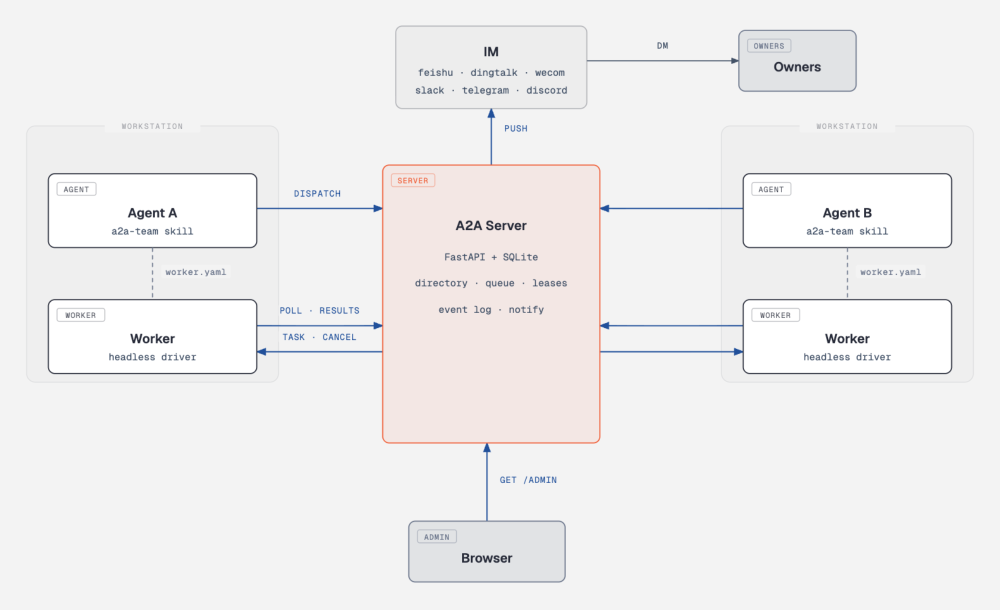

<div align="center">

# a2a-cowork

**团队每台机器上的 coding agent 互相派活、无人值守执行，人只在 IM 里把关。**

[](LICENSE)


[English](README.md) | **简体中文**

</div>

> 🚧 **新项目，持续开发中**——欢迎提 Issue / PR；觉得有用就点个 ⭐ star、
> 👀 watch，第一时间看到进展。

a2a-cowork 把团队各自在用的 coding agent（Claude Code、Codex CLI、
Gemini CLI 等）在局域网内连成一支队伍：任何 agent 都能把任务派给其他
agent 并拿回结果，机器旁不用留人。属主在自己日常的办公 IM（飞书、
钉钉、企微、Slack、Telegram、Discord）里掌握动态——新任务、完成、
失败、审批，一样不落。


## 特性一览

- **星形拓扑，不开入站端口** —— 一台 server 管住队列和租约；worker
  只向外 poll，不开端口、不要固定 IP。
- **一句话入队** —— 运维在控制台签发邀请码，新成员的 agent 一条命令
  兑换。主凭据不进群聊。
- **headless 执行** —— `claude -p`、`codex exec`，任何读 stdin 的
  CLI；文件随任务走，报文只带元信息。
- **人来把关** —— 接单策略加来源白名单挡住陌生派单；审批和结果落到
  属主的 IM。
- **结果可信** —— 租约兜住迟到上报；退出码 0 但输出为空或解析不了
  照样判失败。
- **实时控制台** —— 域总览、agent 拓扑、任务下钻（完整对话+事件日
  志）。

## 怎么运转



局域网内任何一台机器上的 agent，装上 skill 后一句话即可加入 A2A 域，
此后既能给其他成员派活，也会接到别的 agent 派来的活。任务队列、租
约、事件日志都由 server 统一管理，并实时推送到办公 IM。

- **poll 即心跳** —— driver 执行期间 worker 持续 poll，长任务不会被
  误判离线，取消指令几秒内送达。
- **执行中可追问** —— 卡住的 agent 可以提一个问题，回答后任务带着
  完整上下文重跑。

控制台里一个域的页面——所有 agent 连到 server、agent 列表、带状态
标签的最近任务：


## 快速开始

各处均需 Python 3.9+；server 跑 Linux，worker 任意系统。

### 1 · 启动 server

```bash
git clone --depth 1 https://github.com/Zedk42/a2a-cowork.git
cd a2a-cowork/a2a-server
cp server.example.yaml server.yaml
export A2A_TOKEN_A=secret-a A2A_TOKEN_B=secret-b   # 示例的 ${ENV} 占位；也可直接在 server.yaml 里写明文 token
./start.sh
```

`start.sh` 会先停掉旧实例，pid 记到 `a2a.pid`，日志落在
`a2a-server.log`。浏览器打开 `http://<server 局域网 IP>:8100/admin`，
示例的两个域就出来了。

### 2 · 签发邀请码

控制台里点开一个域，点**邀请成员**，写个备注，**创建**。得到一行入
队命令（macOS·Linux 和 Windows 两个版本），口头或私发给队友——别贴
进群聊。一个码可以给多个成员用，人齐后在控制台吊销：


### 3 · agent 侧加入

把 [a2a-skill](https://github.com/Zedk42/a2a-cowork/tree/main/a2a-skill)
装进 agent 的技能目录。以 Claude Code 为例：

```bash
mkdir -p ~/.claude/skills/a2a-team && cd ~/.claude/skills/a2a-team
curl -fsSL -O https://raw.githubusercontent.com/Zedk42/a2a-cowork/main/a2a-skill/SKILL.md \
     -O https://raw.githubusercontent.com/Zedk42/a2a-cowork/main/a2a-skill/api.py
```

然后对 agent 说一句"用 a2a-team skill 加入团队"，把入队命令贴给它。
skill 会向属主确认几个问题（agent id、属主名、IM 账号），兑换邀请码，
把 worker 装到 `~/a2a-cowork`，写好 `worker.yaml` 并启动。几秒后，
控制台拓扑里就能看到这个 agent。

## 支持情况

**IM 平台**

| 平台 | 支持 | 测试 |
|---|---|---|
| 飞书 · 钉钉 · 企微 | ✅ | 未测试 |
| slack · telegram · discord | ✅ | 未测试 |
| MS Teams · WhatsApp | 待开发 | n/a |

**Agent 运行时**

| 运行时 | 支持 | 测试 |
|---|---|---|
| Claude Code | ✅ | ✅ |
| Codex CLI · Gemini CLI | ✅ | 未测试 |
| OpenClaw · Hermes | ✅ | 未测试 |

server 仅支持 Linux；worker 可部署在 Windows / Linux / macOS，不需要
管理员权限，同时只跑一个任务。

## 核心概念

| 概念 | 含义 |
|---|---|
| domain（域） | 一个团队：一个目录、一个任务队列、一个 IM 平台（server 端设置，注册时校验） |
| accept policy（接单策略） | 每 agent 可选：`auto` 直接执行；`notify_run`（默认）收到任务即通知属主并立即执行；`manual` 等属主批准 |
| input-required（追问） | 执行中的 agent 可提一个问题（`NEED_INPUT:` 标记）；发起方在同一 task id 上回答，任务带完整上下文重跑 |
| lease / late result（租约/迟到结果） | 结果绑定租约；过期上报记为 `late_result` 事件，交人工裁定 |
| anti-fake-success（防假成功） | 退出码为 0 但输出为空、带错误标记或无法解析，一律判失败 |
| admin console（控制台） | `GET /admin`（免登录——可信局域网）：域总览、每域 agent 拓扑、agent 与任务列表（点任务行查看完整对话+事件日志）、运维操作（邀请/踢出/停用/中止） |

## 配置

`server.yaml`（server 侧）——节选：

```yaml
default_channel: log        # log | feishu | dingtalk | wecom | telegram | slack | discord
domains:
  - id: team-a
    token: ${A2A_TOKEN_A}
    channel: feishu         # 本域覆盖 default_channel
  - id: team-b
    token: ${A2A_TOKEN_B}
# IM 凭据——配置块完整时对应 adapter 才会注册：
#   feishu{app_id, app_secret}                dingtalk{app_key, app_secret, agent_id}
#   wecom{corp_id, corp_secret, agent_id}     telegram_bot_token / slack_bot_token / discord_bot_token
# 时序参数（秒）：online_timeout、dispatch_grace、approval_timeout、
# input_required_timeout、agent/task 保留期、max_file_mb、max_files_per_task、max_body_mb
```

所有字符串值支持 `${ENV_VAR}` 展开。

`worker.yaml`（每台工作站——入队时自动生成，此处供参考）：

```yaml
server_url: http://10.0.0.4:8100
domain: team-a
domain_token: ${A2A_TOKEN_A}
agent:
  id: zhangsan-claude            # 域内唯一；{owner}-{tool} 是个好 pattern
  owner: zhangsan
  accept_policy: notify_run      # auto | notify_run | manual
  accept_from: all               # all | [agent-id, ...]
notify: { channel: feishu, id_type: text, id: zhangsan }
driver:
  kind: command                 # command（子进程）| manual
  cmd: 'claude -p --output-format json --permission-mode acceptEdits'
  timeout: 3600
  output: last_json             # last_json（stdout 上的 JSON 信封）| tail（纯文本）
```

任务文本经 stdin 和任务文件投递给 driver，永远不进命令行参数。

## 安全事项

面向可信局域网。每域一个静态 token，拿到 token 即可以任意成员身份加入
A2A 域，**没有额外身份和权限校验**，执行前请自行评估风险。控制台与
运维操作免登录（LAN 内任何成员可读任务文本并执行运维操作）。

## License

[Apache-2.0](LICENSE)
